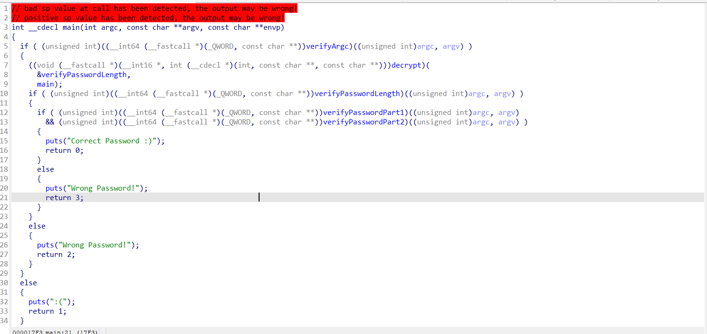

# Description

Dynamic Secrets
When I put this file in Ghidra the flag comparison looks like gibberish, maybe it is doing something at runtime?

# Source

[Source](./src/)
[Zip](./rev_dynamicsecrets.zip)

# Solve


- Bài này khi xem source code thì có vẻ như các hàm kiểm tra mật khẩu () đều đã bị mã hóa, chỉ khi chương trình chạy các hàm này mới được mã hóa và thực thi.(Điều này đúng với miêu tả mà đề bài đưa ra - runtime)
=> Có vẻ bài này phải phân tích động.
- Dùng gdb để solve bài này.
- Những câu lệnh mình đã dùng để solve bài này trong gdb: [History-GDB](./src/history-gdb.txt)
- Đặt breakpoint tại hàm `verifyPasswordLength` và chạy chương trình:
```bash
run aaaaaaa
disas main
b *0x00005555555557b6
run aaaaaaa
disas verifyPasswordLength
```
- Chạy lần lượt các lệnh trên thì sẽ xem được mã asm của hàm `verifyPasswordLength`:
```bash
   0x00005555555551c6 <+0>:     endbr64
   0x00005555555551ca <+4>:     push   rbp
   0x00005555555551cb <+5>:     mov    rbp,rsp
   0x00005555555551ce <+8>:     sub    rsp,0x10
   0x00005555555551d2 <+12>:    mov    DWORD PTR [rbp-0x4],edi
   0x00005555555551d5 <+15>:    mov    QWORD PTR [rbp-0x10],rsi
   0x00005555555551d9 <+19>:    mov    rax,QWORD PTR [rbp-0x10]
   0x00005555555551dd <+23>:    add    rax,0x8
   0x00005555555551e1 <+27>:    mov    rax,QWORD PTR [rax]
   0x00005555555551e4 <+30>:    mov    rdi,rax
   0x00005555555551e7 <+33>:    call   0x555555555070 <strlen@plt>
   0x00005555555551ec <+38>:    cmp    rax,0x2d
   0x00005555555551f0 <+42>:    sete   al
   0x00005555555551f3 <+45>:    movzx  eax,al
   0x00005555555551f6 <+48>:    leave
   0x00005555555551f7 <+49>:    ret
```
- Vậy là độ dài của mật khẩu phải là 0x2d (45) ký tự.
- Tiếp tục, làm tương tự như trên nhưng bây giờ truyền vào 45 ký tự và breakpoint tại hàm `verifyPasswordPart1`:
```bash
run aa
disas main
b *0x00005555555557de
run aaaaaaaaaaaaaaaaaaaaaaaaaaaaaaaaaaaaaaaaaaaaa
disas verifyPasswordPart1
```
- Thu được mã máy của hàm `verifyPasswordPart1` (Dài quá nên quăng vào file này @@): [verifyPasswordPart1](./assets/verifyPasswordPart1.asm)
- Xem qua hàm này, nó sẽ thực hiện so sánh lần lượt các ký tự của password được truyền vào với các mã ascii trong chương trình. Lưu lại những số ascii này và giải mã nó thì thu được `HTB{TH3_S3CR3TS_4R3_R3`
- Tiếp tục với hàm còn lại là `verifyPasswordPart2` và truyền phần đầu của password bằng giá trị vừa tìm được ở trên:
```bash
run aa
disas main
b *0x00005555555557de
run HTB{TH3_S3CR3TS_4R3_R3aaaaaaaaaaaaaaaaaaaaaaa
disas verifyPasswordPart2
```
- Mã máy của hàm `verifyPasswordPart2` [verifyPasswordPart2](./assets/verifyPasswordPart2.asm)
- Hàm này tương tự như với `verifyPasswordPart1`, giải mã tương tự thì lấy được phần còn lại của flag là: `V34L3D_1N_TH3_D3BUGG3R}`

`🚩Flag: HTB{TH3_S3CR3TS_4R3_R3V34L3D_1N_TH3_D3BUGG3R}`