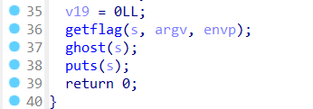
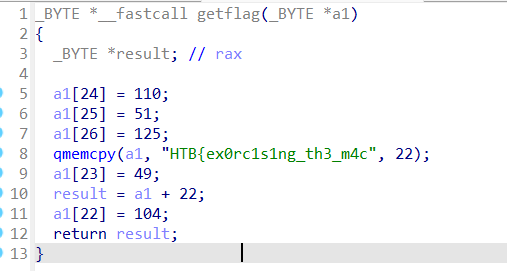

# Description

GhostInTheMachine
I bought this flag generator from a strange shop, but I think it's haunted by an angry spirit - can you exorcise it?

# Source
[Source](./rev_ghostinthemachine/)
[Zip](./rev_ghostinthemachine.zip)

# Solve

- Dùng IDA để xem mã giả của chương trình:
- Ở hàm main có gọi đến hàm `getflag()`, đây chắc là hàm sẽ in ra flag

- Xem hàm `getflag()`

```c
_BYTE *__fastcall getflag(_BYTE *a1)
{
  _BYTE *result; // rax

  a1[24] = 110;
  a1[25] = 51;
  a1[26] = 125;
  qmemcpy(a1, "HTB{ex0rc1s1ng_th3_m4c", 22);
  a1[23] = 49;
  result = a1 + 22;
  a1[22] = 104;
  return result;
}
```
- Vậy chỉ cần tìm a1 là sẽ có được flag

```python
a1 = "HTB{ex0rc1s1ng_th3_m4c"
a1 += chr(104) # a1[22]
a1 += chr(49)  # a1[23]
a1 += chr(110) # a1[24]
a1 += chr(51)  # a1[25]
a1 += chr(125) # a1[26]
print("Flag:", a1)   # HTB{ex0rc1s1ng_th3_m4ch1n3}
```

`🚩Flag: HTB{ex0rc1s1ng_th3_m4ch1n3}`