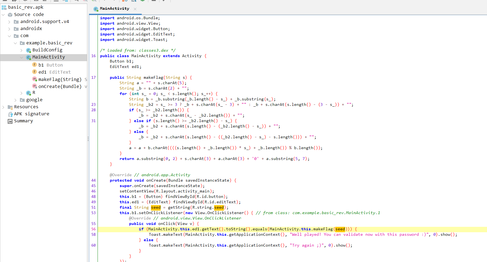
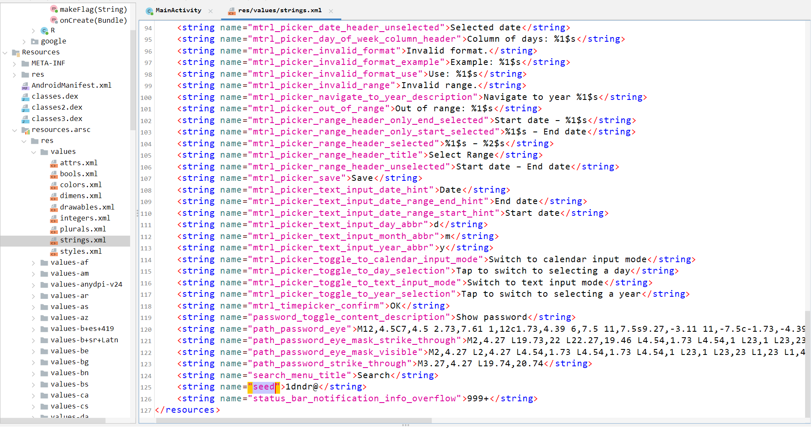

# Source

[Link](./basic_rev.apk)

# Solve

- Because this is an apk file for Android, I will use a tool that specializes in analyzing apk files, __Jadx__.
- Open it in Jadx:
- I found a function in MainActivity (which will be executed first when the program runs) that creates the Flag called __makeFlag__:

- But it needs an input parameter. The input here is a string called __seed__, saved in the string definition file in Android programming, this file is called __strings.xml__.

- Seed is: __1dndr@__
- I recreate the __makeFlag__ function and run it with the seed. You can find it at [here](./MakeFlag.java)
- Run it and the flag will appear
`Flag is: @ndr01d`

`🚩Flag: @ndr01d`