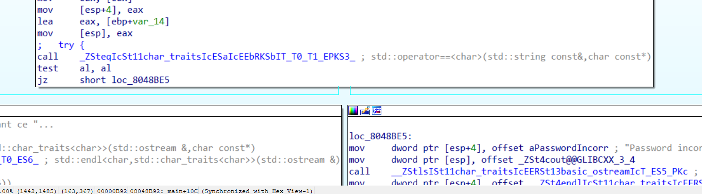
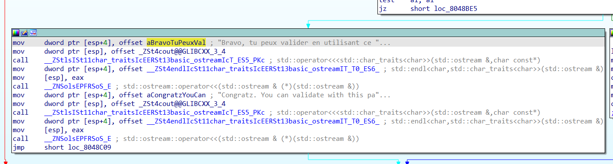
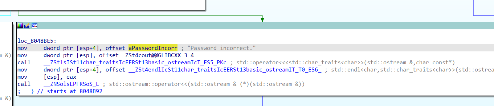

# Source
[Link](./ch25.bin)

# Solve

- Checksec

```bash
$ checksec ch25.bin 
[*] '/home/Security/CTF/Rootme/Cracking/ELF C++ - 0 protection/ch25.bin'
    Arch:     i386-32-little
    RELRO:    Partial RELRO
    Stack:    No canary found
    NX:       NX enabled
    PIE:      No PIE (0x8048000)
```
- Disassembled using IDA 32bit.



- Right here you can see the comparison function being called to perform the comparison. The program will print a greeting if the comparison is True, otherwise it will be "Password Incorect"
- Use gdb to debug.
```bash
$ gdb -q ch25.bin
Reading symbols from ch25.bin...
(No debugging symbols found in ch25.bin)
gdb-peda$ disas main
Dump of assembler code for function main:
...
0x08048b83 <+253>:   add    eax,0x4
0x08048b86 <+256>:   mov    eax,DWORD PTR [eax]
0x08048b88 <+258>:   mov    DWORD PTR [esp+0x4],eax
0x08048b8c <+262>:   lea    eax,[ebp-0x14]
0x08048b8f <+265>:   mov    DWORD PTR [esp],eax
0x08048b92 <+268>:   call   0x8048cf7 <_ZSteqIcSt11char_traitsIcESaIcEEbRKSbIT_T0_T1_EPKS3_>
0x08048b97 <+273>:   test   al,al
0x08048b99 <+275>:   je     0x8048be5 <main+351>
...
```
-  Set a breakpoint right at the function called (__0x08048b92__) to compare and start running the program with arg of 123456789.

```bash
gdb-peda$ b *0x08048b92
Note: breakpoint 1 also set at pc 0x8048b92.
Breakpoint 2 at 0x8048b92
gdb-peda$ run 123456789
[-------------------------------------code-------------------------------------]
   0x8048b88 <main+258>:        mov    DWORD PTR [esp+0x4],eax
   0x8048b8c <main+262>:        lea    eax,[ebp-0x14]
   0x8048b8f <main+265>:        mov    DWORD PTR [esp],eax
=> 0x8048b92 <main+268>:        call   0x8048cf7 <_ZSteqIcSt11char_traitsIcESaIcEEbRKSbIT_T0_T1_EPKS3_>
   0x8048b97 <main+273>:        test   al,al
   0x8048b99 <main+275>:        je     0x8048be5 <main+351>
   0x8048b9b <main+277>:        mov    DWORD PTR [esp+0x4],0x8048dfc
   0x8048ba3 <main+285>:        mov    DWORD PTR [esp],0x804b100
Guessed arguments:
arg[0]: 0xffffce84 --> 0x804f4cc ("Here_you_have_to_understand_a_little_C++_stuffs")             <-------- Notice
arg[1]: 0xffffd127 ("123456789")                                                                 <-------- Notice
[------------------------------------stack-------------------------------------]
0000| 0xffffce70 --> 0xffffce84 --> 0x804f4cc ("Here_you_have_to_understand_a_little_C++_stuffs")
0004| 0xffffce74 --> 0xffffd127 ("123456789")
0008| 0xffffce78 --> 0xffffce8c --> 0x804f3bc --> 0xca15d618 
0012| 0xffffce7c --> 0xf7fc29c0 --> 0xf7aff000 --> 0x464c457f 
0016| 0xffffce80 --> 0xf7b206ac --> 0x21e04c 
0020| 0xffffce84 --> 0x804f4cc ("Here_you_have_to_understand_a_little_C++_stuffs")
0024| 0xffffce88 --> 0x804f3dc --> 0xaf67b350 
0028| 0xffffce8c --> 0x804f3bc --> 0xca15d618 
[------------------------------------------------------------------------------]
Legend: code, data, rodata, value

Breakpoint 1, 0x08048b92 in main ()
gdb-peda$
```

- The input is compared with a string, which is the correct password. Right password is: __"Here_you_have_to_understand_a_little_C++_stuffs"__.
- This is also the flag.

Flag: ___Here_you_have_to_understand_a_little_C++_stuffs___