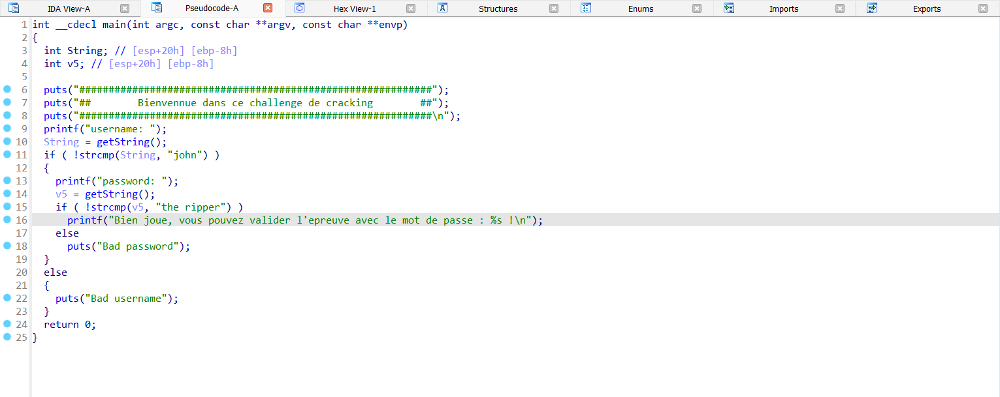

# Source

[Link](./ch2.bin)

# Solve

- Checksec
```bash
checksec ch2.bin 
[*] '/home/Security/CTF/Rootme/Cracking/ELF x86 - Basic/ch2.bin'
    Arch:     i386-32-little
    RELRO:    Partial RELRO
    Stack:    No canary found
    NX:       NX enabled
    PIE:      No PIE (0x8048000)
```

- Disassembled using IDA, I have the pseudocode of the main function:

```c
int __cdecl main(int argc, const char **argv, const char **envp)
{
  int String; // [esp+20h] [ebp-8h]
  int v5; // [esp+20h] [ebp-8h]

  puts("############################################################");
  puts("##        Bienvennue dans ce challenge de cracking        ##");
  puts("############################################################\n");
  printf("username: ");
  String = getString();
  if ( !strcmp(String, "john") )
  {
    printf("password: ");
    v5 = getString();
    if ( !strcmp(v5, "the ripper") )
      printf("Bien joue, vous pouvez valider l'epreuve avec le mot de passe : %s !\n");
    else
      puts("Bad password");
  }
  else
  {
    puts("Bad username");
  }
  return 0;
}
```
- So, username is: john, password is: the ripper. Run program:
```bash
$ ./ch2.bin
############################################################
##        Bienvennue dans ce challenge de cracking        ##
############################################################

username: john
password: the ripper
Bien joue, vous pouvez valider l'epreuve avec le mot de passe : 987654321 !
```

Flag: ___987654321___