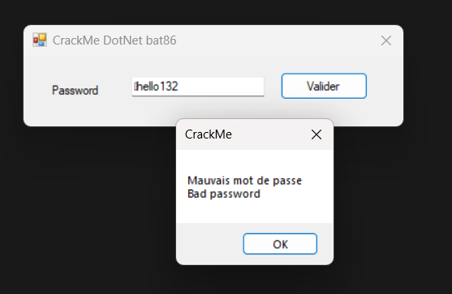
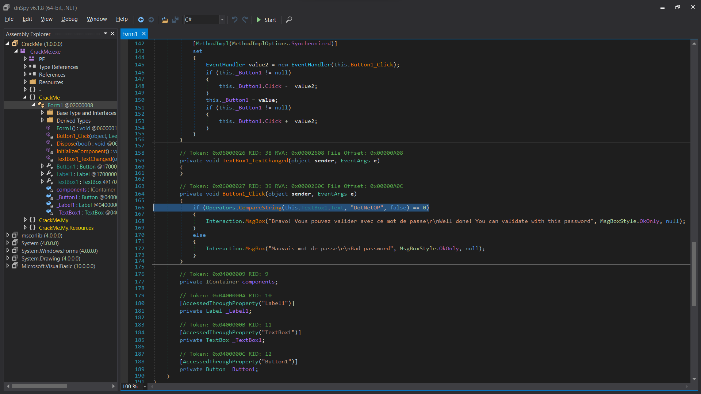

# Source

[Link](./ch22.exe)

# Solve
- Run file:

- File analysis:
```bash
$ file ch22.exe 
ch22.exe: PE32 executable (GUI) Intel 80386 Mono/.Net assembly, for MS Windows, 4 sections
```
- This program is written in C#. I will analyze it using dnSpy (A C# source code decompiler software).

- I found a function that handles user input with a fixed string __"DotNetOP"__.
- Try it by run program:


🚩Flag: ___DotNetOP___