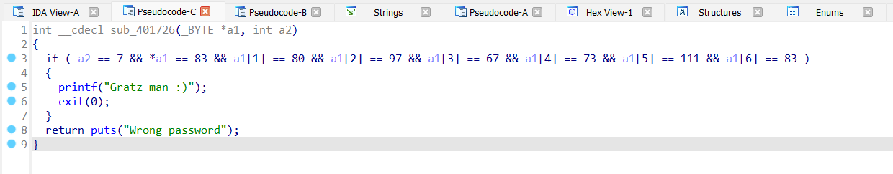

# Source

[Source](./ch15.exe)

# Solve

- File analysis:
```bash
$ file ch15.exe 
ch15.exe: PE32 executable (console) Intel 80386 (stripped to external PDB), for MS Windows, 7 sections
```
- Disassembled using IDA 32bit.
- Looking at all the strings that appear in this show, I see the strings as "Gratz man :)". It can be an accurate message when typed correctly. I went to the place where it was called and found this function:

```c
int __cdecl sub_401726(_BYTE *a1, int a2)
{
  if ( a2 == 7 && *a1 == 83 && a1[1] == 80 && a1[2] == 97 && a1[3] == 67 && a1[4] == 73 && a1[5] == 111 && a1[6] == 83 )
  {
    printf("Gratz man :)");
    exit(0);
  }
  return puts("Wrong password");
}
```

- Analyze this code and translate back the values of a1 and a2. Maybe a2 is the length of a1. If so, a1 would have seven characters and the characters would be compared to the ASCII codes one by one.
- I figured out what the value of a1 is: __SPaCIoS__
- This is also the flag.

🚩Flag: ___SPaCIoS___