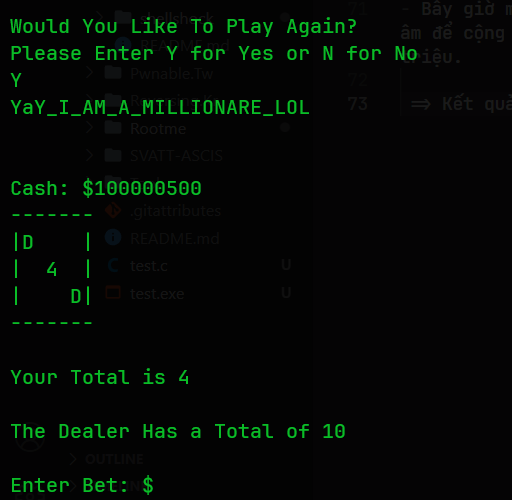

# Source

Hey! check out this C implementation of blackjack game!
I found it online
* http://cboard.cprogramming.com/c-programming/114023-simple-blackjack-program.html

I like to give my flags to millionares.
how much money you got?


Running at : nc pwnable.kr 9009

[Source]()

# Solve

- Phân tích chương trình mã nguồn, thì chương trình này cơ bản sẽ là một trò chơi bài cho phép đặt cược. Ban đầu bạn sẽ có 500$. Mục tiêu là làm sao để số tiền của bạn phải lớn hơn 1 triệu $ thì flag sẽ xuất hiện.
- Qua luồng thực thi của chương trình thì mình chú ý một hàm là __betting__:

```c
int betting() // Asks user amount to bet
{
    printf("\n\nEnter Bet: $");
    scanf("%d", &bet);

    if (bet > cash) // If player tries to bet more money than player has
    {
        printf("\nYou cannot bet more money than you have.");
        printf("\nEnter Bet: ");
        scanf("%d", &bet);
        return bet;
    }
    else
        return bet;
} // End Function
```
- Đây là hàm để đặt cược tiền, số tiền đặt cược không được lớn hơn số tiền đang có. Tuy nhiên biến __bet__ lại không được kiểm soát chặt chẽ.
Bạn có thể xem logic của chương trình khi thua thì sẽ như thế nào như dưới đây:
```c
if (player_total >= dealer_total) // If player's total is more than dealer's total, win
{
    printf("\nUnbelievable! You Win!\n");
    won = won + 1;
    cash = cash + bet;
    printf("\nYou have %d Wins and %d Losses. Awesome!\n", won, loss);
    dealer_total = 0;
    askover();
}
if (player_total < dealer_total) // If player's total is less than dealer's total, loss
{
    printf("\nDealer Has the Better Hand. You Lose.\n");
    loss = loss + 1;
    cash = cash - bet;
    printf("\nYou have %d Wins and %d Losses. Awesome!\n", won, loss);
    dealer_total = 0;
    askover();
}
if (dealer_total > 21) // If dealer's total is more than 21, win
{
    printf("\nUnbelievable! You Win!\n");
    won = won + 1;
    cash = cash + bet;
    printf("\nYou have %d Wins and %d Losses. Awesome!\n", won, loss);
    dealer_total = 0;
    askover();
}
```
- Vậy nếu thua thì số tiền của bạn sẽ được tính theo logic `cash = cash - bet`. Vậy nếu __bet__ là số âm thì sao 🤔🤔🤔.
---
- 💥 Tới đây, thì có thể bạn cũng đã hiểu cách để bypass rồi =)))
- Bây giờ mình chạy chương trình trên server và truyền vào một số âm để cộng với số tiền hiện tại cộng với nó sẽ là một số >= 1 triệu.

 => Kết quả:
 

### 🚩Flag: `YaY_I_AM_A_MILLIONARE_LOL`