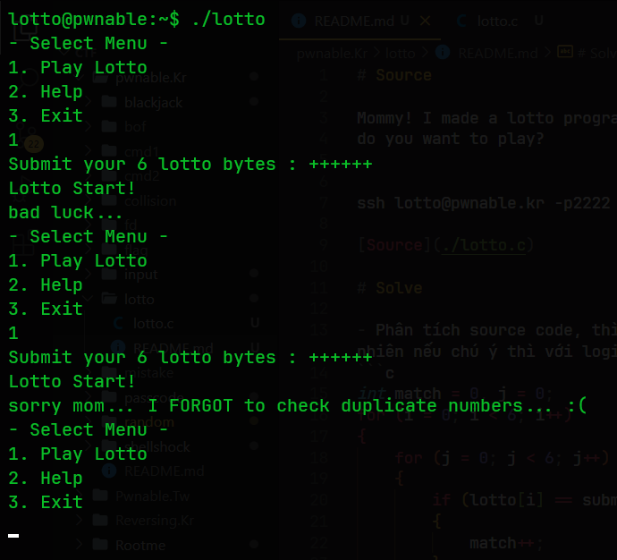

# Source

Mommy! I made a lotto program for my homework.
do you want to play?


ssh lotto@pwnable.kr -p2222 (pw:guest)

[Source](./lotto.c)

# Solve

- Phân tích source code, thì chương trình sẽ thực hiện việc lấy đầu vào 6 ký tự của người dùng nhập để so sánh với 6 ký tự ngẫu nhiên. Tuy nhiên nếu chú ý thì với logic đoạn code sau thì chỉ cần 1 trong 6 ký tự trùng với ký tự có trong chuỗi ngẫu nhiên thì sẽ bypass được:
```c
int match = 0, j = 0;
for (i = 0; i < 6; i++)
{
    for (j = 0; j < 6; j++)
    {
        if (lotto[i] == submit[j])
        {
            match++;
        }
    }
}
```
- Vì vậy, chỉ cần chạy chương trình với một đầu vào gồm 6 ký tự giống nhau (ký tự có mã ascii nằm trong khoảng 1-45, ở đây sẽ chọn '+').
- Lặp lại nhiều lần thì sẽ thu được flag như sau:


### 🚩Flag: `sorry mom... I FORGOT to check duplicate numbers... :(`